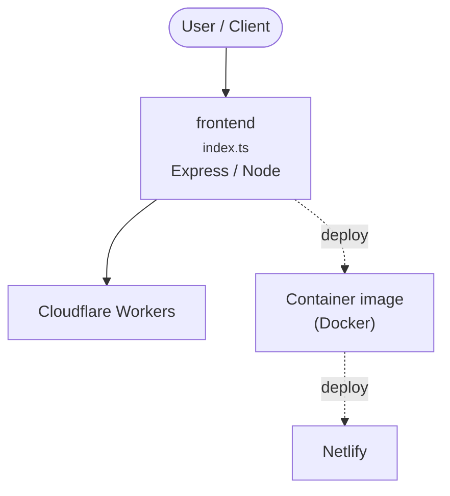

# Context Map — `frontend`

> Auto-generated architecture & deployment context map. Summarizes the core application, container/cloud footprint, and database connections. Regenerate after significant structural changes.

**Repo:** `avnit/frontend` · **Fork** · Public · Primary language: TypeScript · Default branch: `dev` · Files: 3394

**Description:** :lollipop: Frontend for Home Assistant

## 1. Core application

Home Assistant Frontend

- **Frameworks / runtime:** Express / Node
- **Entry points:** `demo/src/configs/arsaboo/index.ts`, `demo/src/configs/jimpower/index.ts`, `demo/src/configs/kernehed/index.ts`, `demo/src/configs/sections/index.ts`, `demo/src/configs/teachingbirds/index.ts`, `src/data/context/index.ts`
- **Listens on port(s):** 8080, 8123, 53, 8090, 8095, 8100

## 2. Containers & cloud applications

**Containers:**
- `.devcontainer/Dockerfile`
- `.devcontainer/devcontainer.json`

**Cloud deploy / serverless manifests:**
- `netlify.toml`

**Detected cloud platforms / services:** Cloudflare Workers, Netlify

## 3. Database connections

_No database drivers or connection strings detected._

## 4. Architecture diagram

## 5. Security posture

- **Dependabot alerts (open):** 18 high, 10 medium
- **Static scan findings:** 8 high, 15 medium

| Severity | Rule | File:Line |
|---|---|---|
| high | generic-secret-assign | `demo/src/configs/arsaboo/entities.ts:333` |
| high | generic-secret-assign | `demo/src/configs/arsaboo/entities.ts:345` |
| high | generic-secret-assign | `demo/src/configs/arsaboo/entities.ts:357` |
| high | generic-secret-assign | `demo/src/configs/arsaboo/entities.ts:369` |
| high | generic-secret-assign | `demo/src/stubs/application_credentials.ts:9` |
| high | generic-secret-assign | `gallery/src/data/demo_states.js:548` |
| high | generic-secret-assign | `gallery/src/pages/lovelace/picture-elements-card.ts:29` |
| high | js-eval | `test/panels/lovelace/cards/hui-picture-elements-card.test.ts:14` |

---
_Generated by repo context-mapping pass on 2026-08-13._